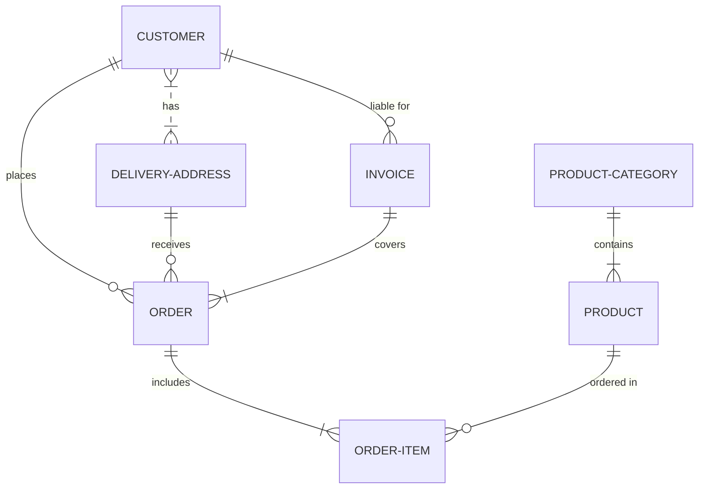
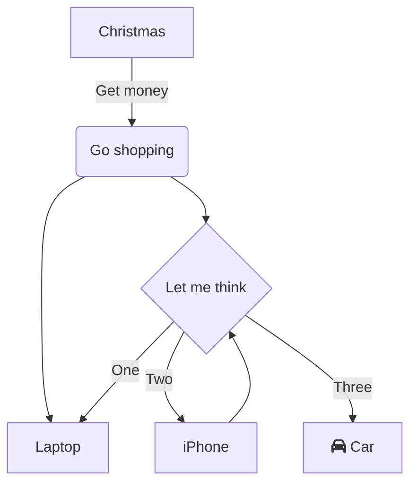

# cyberdinge.wireguard

Creates a peer2peer wireguard network between the hosts in the project

## Requirements

a,b und c

## Defaults

``` YAML 
--8<-- "./wireguard/defaults/main.yaml"
```

# Network





## Generate wireguard configs for users of the project

The users configured in the project must have `wireguard_address` and `wireguard_public_key` set as variables in their profile.
If this is the case, they are automatically configured as peers on all hosts and can connect to them via wireguard.
To generate config files for the individual users, a command can be passed to the role via a variable `cmd: userconfigs`. 

``` YAML title="generate_wireguard_user_configs.yaml"
#!/usr/bin/env ansible-playbook
---

- name: Provision a vagrant host project
  hosts: localhost
  gather_facts: no
  become: no
  vars:
    project_state: present
  vars_files:
    - vars/users.yaml
  roles:

    - role: cyberdinge.cloud.wireguard
      vars:
        cmd: userconfigs
        
        # optional: overwrite the role var to place the configfile in a custom location
        # wireguard_local_client_config_directory: ./mydir/
```

When the playbook is executed, appropriate wireguard client configs are generated for each user in the `./wireguard_clients/` directory.

``` INI title="./wireguard_clients/testuser.conf"
# user config for 'testuser' wireguard network "projectdemo"
[Interface]
Address = 172.0.190.240/24
PrivateKey = < place the private key here >

# ----------------------------------------------------
# 
# peers from inventory group 'projectdemo'
#

[Peer]
# host: host1
PublicKey = +6MehCbaIiU9s7fki3kMTRjYDu10HMXLFQRFPZghyG0=
AllowedIPs = 172.0.190.101
Endpoint = 1.2.3.4:10001
PersistentKeepalive = 25

[Peer]
# host: host2
PublicKey = +6MehCbaIiU9s7fki3kMTRjYDu10HMXLFQRFPZghyG0=
AllowedIPs = 172.0.190.102
Endpoint = 1.2.3.5:10001
PersistentKeepalive = 25
```

## activate wireguard provile for users

``` BASH
# wg-quick up wireguard_clients/<username>.conf 
wg-quick up wireguard_clients/testuser.conf 
```

``` BASH
# wg-quick down wireguard_clients/<username>.conf 
wg-quick down wireguard_clients/testuser.conf 
```